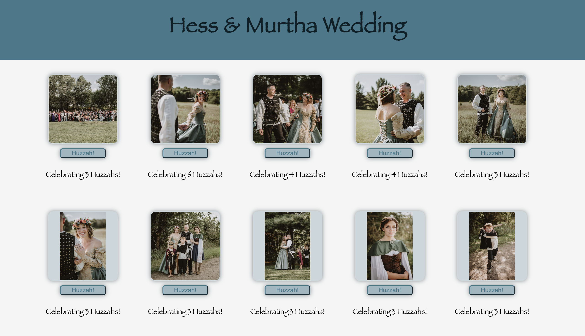

# Weekend React Gallery

## Description

_Duration: 2 Day Sprint_

This weekend project was to create a gallery of images utilizing react as the newest content learned.

I started by creating a database with Postico and set up my pathways thru the server, router, and pool files.  
App.jsx was my Parent file that I used for a GET Route to retrieve my database components. I then passed the data 
to the GalleryList file. The GalleryList was used as the container for all of my images. I used .map to filter through
the data and proceeded to pass each database row component to the GalleryItem file. The GalleryItem was used to organize
each image block containing the image, a button, and text. A conditional was also used to allow users to, on click, have
additional details appear on screen.

To see the fully functional site, please visit: [DEPLOYED VERSION OF APP](https://peaceful-brook-33600.herokuapp.com/)

## Screen Shot

## Usage

1. Mouse Hover to expand pic
2. Click pic to show comment
3. Click pic again to hide comment
4. Click [Huzzah!] button to show your support

## Built With

    *   JavaScript
    *   HTML
    *   CSS
    *   React
    *   Express
    *   pg
    *   axios
    *   Node

## Acknowledgement
Thanks to the L`Engle Cohort and [Prime Digital Academy](www.primeacademy.io) who equipped and helped me to make this application a reality.

## Support
If you have suggestions or issues, please email me at [ryanmhess@gmail.com]